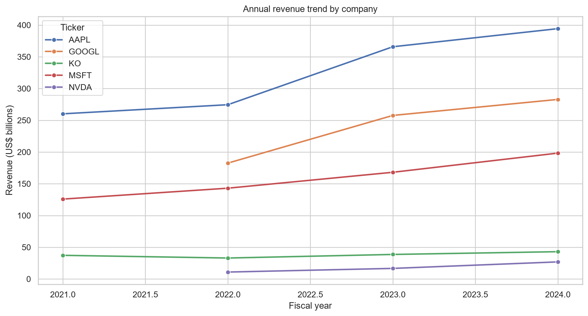
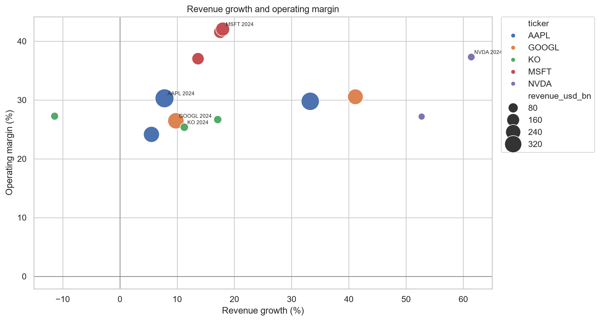
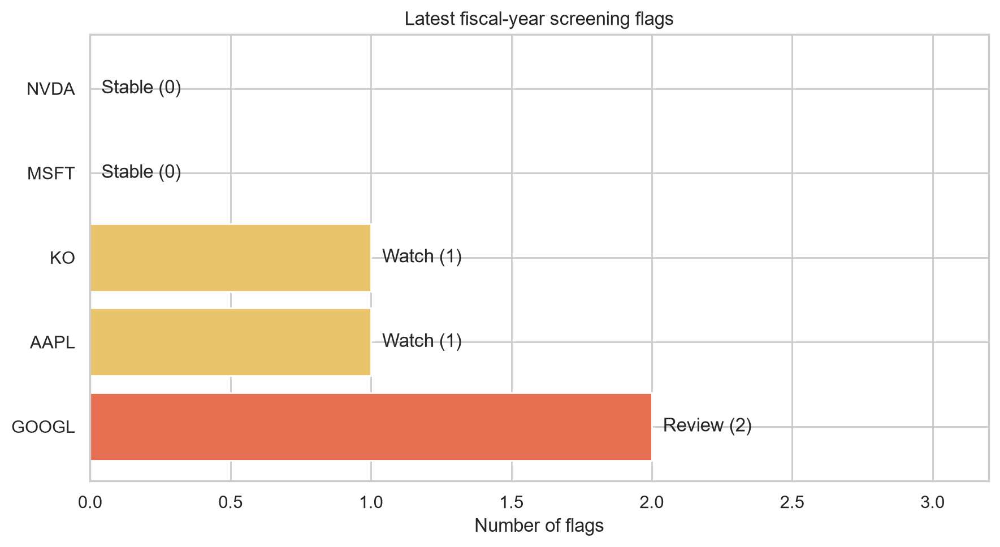

# Multi-Company Fundamental Health Screener

## Project Overview

This independent Python and SQL analysis screens annual SEC EDGAR filing data for five public companies—Apple, Microsoft, NVIDIA, Coca-Cola, and Alphabet. It standardizes key financial metrics across filings, calculates multi-year trends, and highlights changes that deserve follow-up research.

- **Project type:** Financial-data trend screening
- **Data period:** Fiscal years 2021–2024, where available
- **Data source:** SEC EDGAR Company Facts API
- **Tools:** Python, pandas, SQLite, SQL, Excel-ready CSV, Matplotlib, and Seaborn

> **Educational use only.** This is not investment advice, a valuation model, or a company-quality ranking.

## Business Problem

Comparing company fundamentals across SEC filings is time-consuming because fiscal calendars, filing dates, and XBRL tags can differ. The goal was to build a reproducible screener that answers one focused question:

**Which companies show meaningful changes in revenue growth, operating margin, or receivables relative to their own prior-year performance?**

## Methodology

### 1. Data preparation

- Retrieved annual 10-K company facts from the SEC EDGAR Company Facts API.
- Standardized revenue, net income, operating income, and accounts receivable across varying XBRL tags.
- Evaluated a defined tag fallback list and selected the available tag with the strongest annual coverage.
- Loaded 18 annual company records into a reproducible SQLite database.

### 2. SQL trend analysis

The analysis uses `LAG()` and `PARTITION BY` window functions to calculate year-over-year metrics for each company:

| Metric | Calculation | Purpose |
| --- | --- | --- |
| Revenue growth | `(revenue / prior revenue - 1) × 100` | Measures top-line direction and pace |
| Operating margin | `operating income / revenue × 100` | Measures operating profitability |
| Net margin | `net income / revenue × 100` | Measures bottom-line profitability |
| Receivables growth | `(receivables / prior receivables - 1) × 100` | Identifies credit and collection trends |

### 3. Screening rules

- **Margin contraction:** operating margin falls at least 3 percentage points year over year.
- **Growth deceleration:** revenue growth is at least 5 percentage points below the prior year's growth rate.
- **Receivables warning:** receivables growth exceeds revenue growth by at least 10 percentage points.

`Stable` indicates no flags, `Watch` indicates one flag, and `Review` indicates two or more flags. These labels identify records for further research; they do not make investment recommendations.

## Key Results

Latest available fiscal-year results from the screening model:

| Company | Ticker | Fiscal year | Revenue growth | Operating margin | Flags | Status |
| --- | --- | ---: | ---: | ---: | ---: | --- |
| Alphabet | GOOGL | 2024 | 9.8% | 26.5% | 2 | Review |
| Apple | AAPL | 2024 | 7.8% | 30.3% | 1 | Watch |
| Coca-Cola | KO | 2024 | 11.2% | 25.4% | 1 | Watch |
| Microsoft | MSFT | 2024 | 18.0% | 42.1% | 0 | Stable |
| NVIDIA | NVDA | 2024 | 61.4% | 37.3% | 0 | Stable |

### Findings

1. **Alphabet** received two mechanical flags in its latest record, driven by operating-margin contraction and slower revenue growth than the prior year.
2. **Apple** and **Coca-Cola** each received one growth-deceleration flag, prompting further filing-level review rather than a conclusion about performance.
3. **Microsoft** and **NVIDIA** had no latest-year flags under the defined rules.

## Visualizations

### Revenue Trend by Company



### Revenue Growth vs. Operating Margin



### Latest-Year Screening Flags



## Project Structure

```text
multi-company-fundamental-screener/
├── data/
│   ├── raw/              # Local SEC API responses (not published)
│   └── processed/        # Clean fundamentals and screening output
├── python/               # Reproducible data pipeline
├── sql/                  # SQLite schema, health view, and business queries
├── visualizations/       # Generated analysis charts
├── reports/              # Written findings report
└── docs/                 # Methodology and data notes
```

## Technical Skills Demonstrated

- **Python:** API data collection, data cleaning, validation, and reporting with pandas.
- **SQL:** SQLite database design, window functions, `LAG()`, `PARTITION BY`, CTEs, and analytical business queries.
- **Financial analysis:** Revenue, profitability, and receivables trend analysis using annual 10-K data.
- **Data visualization:** Business-focused charts built with Matplotlib and Seaborn.
- **Data communication:** Converts metric changes into transparent screening rules and a concise findings report.

## Limitations

Companies use different fiscal calendars and accounting presentations. Acquisitions, divestitures, amended filings, and changing XBRL tags can affect comparisons. The model excludes valuation, cash flow, debt, stock-price performance, guidance, segment mix, and non-financial risk.

See [the methodology notes](docs/methodology.md) and [findings report](reports/final_report.md) for details.
